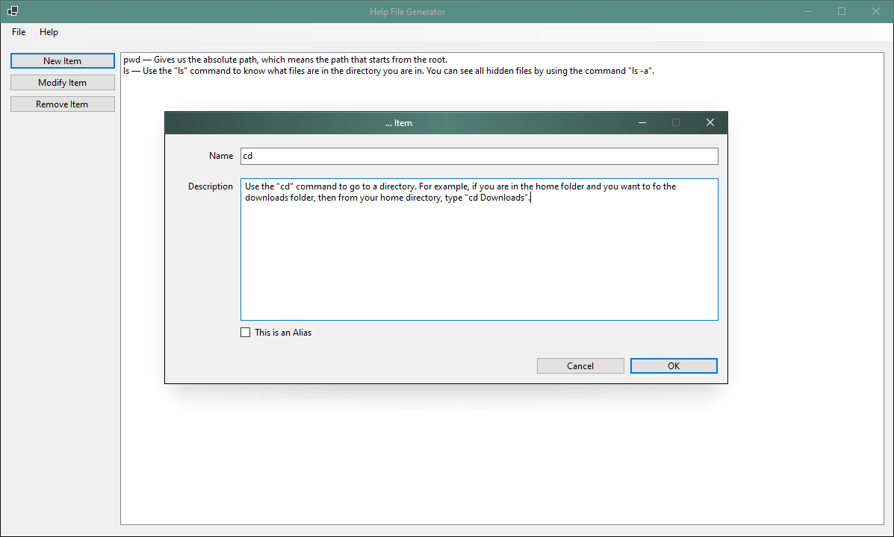

 

  

  <h3 align="center">Help File Creation Tool</h3>

  

    A project developed to make help files easy to import into a website via JSON formatting.
     
     
     
    <a href="https://github.com/Blizzardo1/Help-File-Generator">View Demo</a>
    .
    <a href="https://github.com/Blizzardo1/Help-File-Generator/issues">Report Bug</a>
    .
    <a href="https://github.com/Blizzardo1/Help-File-Generator/issues">Request Feature</a>
  

      

## Table Of Contents

* [About the Project](#about-the-project)
* [Built With](#built-with)
* [Getting Started](#getting-started)
  * [Prerequisites](#prerequisites)
* [Usage](#usage)
* [Contributing](#contributing)
* [License](#license)
* [Authors](#authors)

## About The Project

This project has just started development and does not foresee attention right away.  A useful tool in loading a JSON file curated for HTML generated sites. Generate the JSON and then import to the website that accepts JSON for parsing into a table.

## Built With

Mainly .NET 5.0; considering .NET 6.0 for a more modern behavior. Written mainly and compiled under Visual Studio 2019.

## Getting Started

Fork this project or straight-up download it and open the project.

### Prerequisites

NewtonSoft.Json is a major prerequisite for continuing development of this project.

## Usage

This program is a tool (or aide) in generating essentially a beginner's man page for easy command referencing. Simply open the program and start adding new entries. Saving is Ctrl+S or File -> Save.

## Contributing

Contributions are what make the open source community such an amazing place to be learn, inspire, and create. Any contributions you make are **greatly appreciated**.
* If you have suggestions for adding or removing projects, feel free to [open an issue](https://github.com/Blizzardo1/Help-File-Generator/issues/new) to discuss it, or directly create a pull request after you edit the *README.md* file with necessary changes.
* Please make sure you check your spelling and grammar.
* Create individual PR for each suggestion.
* Please also read through the [Code Of Conduct](https://github.com/Blizzardo1/Help-File-Generator/blob/main/CODE_OF_CONDUCT.md) before posting your first idea as well.

### Creating A Pull Request

1. Fork the Project
2. Create your Feature Branch (`git checkout -b feature/AmazingFeature`)
3. Commit your Changes (`git commit -m 'Add some AmazingFeature'`)
4. Push to the Branch (`git push origin feature/AmazingFeature`)
5. Open a Pull Request

## License

Distributed under the MIT License. See [LICENSE](https://github.com/Blizzardo1/Help-File-Generator/blob/main/LICENSE.md) for more information.

## Authors

* **Adonis Deliannis** - *Just your run of the mill developer* - [Adonis Deliannis](https://github.com/Blizzardo1/) - *Creator of this here project*
